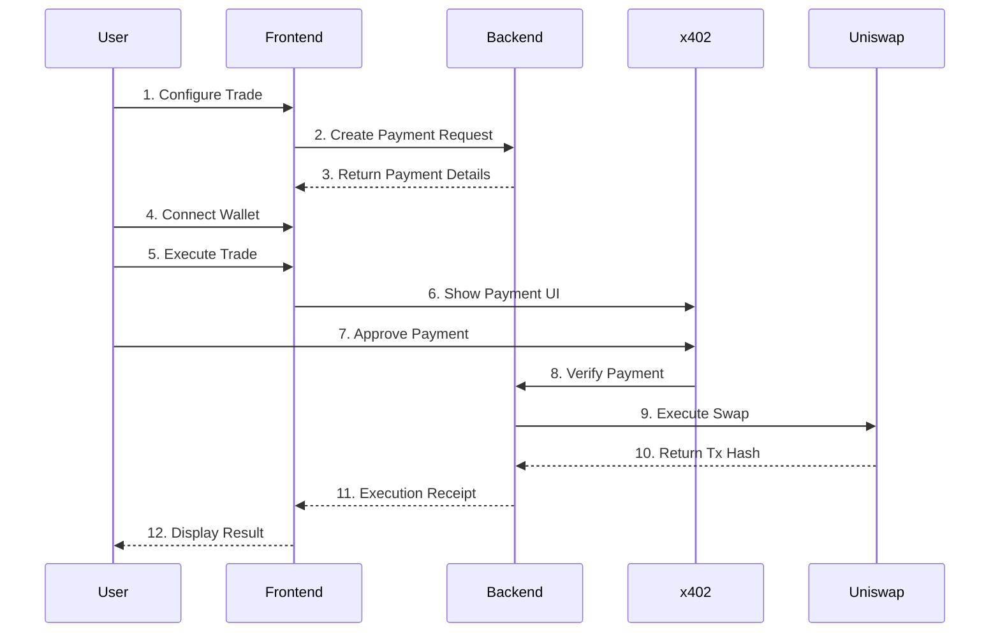

# AgentPay Relay


> **Execute AI-powered spot trades on Uniswap with one-time x402 payments. No API keys. No custody.**

AgentPay Relay is a revolutionary Web3 application that enables autonomous AI agents and users to execute decentralized spot trades using a pay-per-trade model. Built on the x402 payment protocol, it eliminates traditional barriers like API keys, custody requirements, and complex authentication systems.

---

## 🌟 Key Features

### 🤖 AI Trading Agents
- **Trend Follower**: Momentum-based strategy following market trends
- **Breakout Sniper**: Captures breakouts from consolidation patterns  
- **Mean Reversion**: Trades against extremes, betting on price normalization

### 💰 x402 Payment Protocol
- **One-time payments**: Pay only when you trade
- **No custody**: Funds remain in your wallet until execution
- **Wallet-based**: No API keys or traditional authentication
- **Atomic execution**: Payment verification coupled with trade execution

### 🔄 Uniswap V3 Integration
- **Deep liquidity**: Direct access to Uniswap V3 pools on Base Sepolia
- **Spot trading**: Buy/sell tokens instantly at market prices
- **Multiple pairs**: Support for USDC/BTC and extensible to more pairs
- **Slippage protection**: Configurable tolerance for price movements

### 🔐 Security & Privacy
- **Non-custodial**: You control your private keys
- **Permissionless**: No KYC or account creation
- **Transparent**: All transactions on-chain and verifiable
- **Secure payments**: Cryptographic verification via x402 facilitator

---

## 🏗️ Architecture

```
┌─────────────────────────────────────────────────────────────┐
│                     Frontend Layer                           │
│  • Next.js 14 with App Router                               │
│  • React + TypeScript                                        │
│  • Wagmi + Web3Modal (Wallet Connection)                    │
│  • x402-fetch (Payment Handling)                            │
│  • Framer Motion (Animations)                               │
└─────────────────────────────────────────────────────────────┘
                            ↓
┌─────────────────────────────────────────────────────────────┐
│                     Backend Layer                            │
│  • Next.js API Routes                                        │
│  • x402 Middleware (Payment Verification)                   │
│  • Trading Agents (Strategy Execution)                      │
│  • Uniswap V3 Integration (Swap Execution)                  │
│  • SQLite Database (Trade History)                          │
└─────────────────────────────────────────────────────────────┘
                            ↓
┌─────────────────────────────────────────────────────────────┐
│                  Infrastructure Layer                        │
│  • Base Sepolia L2 Network                                   │
│  • Uniswap V3 Protocol                                       │
│  • x402 Facilitator (Payment Settlement)                    │
│  • Smart Contracts (ERC20 Tokens)                           │
└─────────────────────────────────────────────────────────────┘
```

---

## 🚀 Quick Start

### Prerequisites

- **Bun** (JavaScript runtime) - [Install Bun](https://bun.sh)
- **Foundry** (for smart contracts) - [Install Foundry](https://book.getfoundry.sh/getting-started/installation)
- **Base Sepolia ETH** - [Get from faucet](https://www.coinbase.com/faucets/base-ethereum-sepolia-faucet)
- **WalletConnect Project ID** - [Get from WalletConnect](https://cloud.walletconnect.com)

### Installation

```bash
# Clone the repository
git clone https://github.com/vedantanand17/AgentPay.git
cd AgentPay

# Install dependencies
bun install

# Set up environment variables
cp .env.example .env.local
# Edit .env.local with your configuration
```

### Environment Configuration

Create a `.env.local` file with the following variables:

```env
# Base Sepolia Network
BASE_SEPOLIA_RPC_URL=https://sepolia.base.org
UNISWAP_V3_FACTORY=0x4752ba5DBc23f44D87826276BF6Fd6b1C372aD24
UNISWAP_V3_SWAP_ROUTER=0x94cC0AaC535CCDB3C01d6787D6413C739ae12bc4
BASE_SEPOLIA_USDC_ADDRESS=0xB6c34A382a45F93682B03dCa9C48e3710e76809F
BASE_SEPOLIA_BTC_ADDRESS=0xb9B962177c15353cd6AA49E26c2b627b9CC35457

# Execution Wallet (must have gas + tokens)
EXECUTION_PRIVATE_KEY=0x...

# x402 Payment Configuration
X402_PAYMENT_ADDRESS=0x...  # Your payment recipient address
X402_NETWORK=base-sepolia
X402_ENV=testnet

# WalletConnect
NEXT_PUBLIC_WALLETCONNECT_PROJECT_ID=your-project-id-here

# Database (optional)
DATABASE_PATH=./agentpay.db
```

### Run Development Server

```bash
bun run dev
```

Open [http://localhost:3000](http://localhost:3000) in your browser.

---

## 📖 How It Works

### Trade Execution Flow



### Step-by-Step Process

1. **Configure Trade**
   - Select trading agent (Trend Follower, Breakout Sniper, Mean Reversion)
   - Choose token symbol (BTC, ETH, SOL)
   - Set trade side (Buy/Sell) and size
   - Get AI agent suggestion (optional)

2. **Create Payment Request**
   - Backend creates `TradeIntent` with status "pending"
   - Generates x402 payment configuration
   - Returns payment amount and trade details

3. **Connect Wallet**
   - User connects via Web3Modal (MetaMask, Coinbase Wallet, WalletConnect)
   - Wallet address used for receiving tokens

4. **Execute Trade**
   - User clicks "Execute Trade"
   - x402-fetch detects payment requirement
   - Wallet shows payment confirmation UI
   - User approves payment transaction

5. **Payment Verification**
   - x402 middleware verifies payment proof
   - Facilitator confirms payment on-chain
   - Trade intent status updated to "paid"

6. **Swap Execution**
   - Backend approves token spending
   - Executes swap on Uniswap V3
   - Tokens sent to user's wallet
   - Transaction hash recorded

7. **Completion**
   - Executed trade saved to database
   - Receipt displayed with tx hash and execution price
   - Recent trades list updated

---

## 🎯 Use Cases

### For AI Agents
- **Autonomous trading**: Execute trades without human intervention
- **Pay-per-use**: No subscription fees or upfront costs
- **API-first design**: Clean endpoints with predictable responses
- **Programmatic access**: Easy integration with agent frameworks

### For Traders
- **Privacy-focused**: No KYC or account creation
- **Non-custodial**: Maintain full control of funds
- **Strategy testing**: Experiment with different trading agents
- **Low barrier**: Start trading with just a wallet

### For Developers
- **Open source**: Full codebase available for learning
- **Extensible**: Add new agents, tokens, or features
- **Modern stack**: Next.js, TypeScript, Wagmi, viem
- **Well-documented**: Comprehensive guides and examples

---

## 🛠️ Tech Stack

### Frontend
- **Framework**: Next.js 14 (App Router)
- **Language**: TypeScript 5.5
- **Styling**: Tailwind CSS
- **Animations**: Framer Motion
- **Web3**: Wagmi, viem, Web3Modal
- **State**: React hooks, TanStack Query

### Backend
- **Runtime**: Bun
- **Framework**: Next.js API Routes
- **Database**: SQLite (better-sqlite3)
- **Payment**: x402 protocol (@coinbase/x402)
- **Blockchain**: viem (Ethereum interactions)

### Smart Contracts
- **Framework**: Foundry
- **Language**: Solidity 0.8.20
- **Standards**: OpenZeppelin ERC20
- **Protocol**: Uniswap V3

### Infrastructure
- **Network**: Base Sepolia (L2 testnet)
- **DEX**: Uniswap V3
- **Facilitator**: x402.org
- **Deployment**: Vercel (recommended)

---

## 📁 Project Structure

```
AgentPay/
├── app/                          # Next.js app directory
│   ├── api/                      # API routes
│   │   ├── agents/              # Agent endpoints
│   │   │   ├── route.ts         # GET /api/agents
│   │   │   └── suggest/         # POST /api/agents/suggest
│   │   ├── balances/            # GET /api/balances
│   │   ├── pools/               # Pool management
│   │   └── trades/              # Trade endpoints
│   │       ├── route.ts         # GET /api/trades
│   │       ├── create-intent/   # POST /api/trades/create-intent
│   │       └── execute/         # POST /api/trades/execute
│   ├── trade/                   # Trade console page
│   ├── layout.tsx               # Root layout
│   ├── page.tsx                 # Landing page
│   ├── providers.tsx            # Wagmi providers
│   └── globals.css              # Global styles
│
├── components/                   # React components
│   └── ui/                      # UI components
│       ├── hero.tsx             # Hero section
│       ├── navbar.tsx           # Navigation bar
│       ├── feature-card.tsx     # Feature cards
│       ├── how-it-works.tsx     # How it works section
│       ├── portfolio-balance.tsx # Portfolio display
│       └── ...                  # Other UI components
│
├── lib/                         # Core libraries
│   ├── agents.ts                # Trading agent strategies
│   ├── db.ts                    # SQLite database operations
│   ├── types.ts                 # TypeScript type definitions
│   ├── uniswap.ts               # Uniswap V4 integration
│   ├── uniswap-v3.ts            # Uniswap V3 integration
│   ├── wagmi-config.ts          # Wagmi configuration
│   ├── x402.ts                  # x402 payment config
│   └── x402-middleware.ts       # x402 middleware
│
├── contracts/                    # Smart contracts (Foundry)
│   ├── src/                     # Contract source code
│   │   ├── MockERC20.sol        # Mock ERC20 token
│   │   └── interfaces/          # Uniswap interfaces
│   ├── script/                  # Deployment scripts
│   │   ├── DeployTokens.s.sol   # Deploy mock tokens
│   │   ├── DeployPool.s.sol     # Create Uniswap pool
│   │   ├── AddLiquidity.s.sol   # Add liquidity
│   │   └── Deploy.sh            # Automated deployment
│   ├── test/                    # Contract tests
│   └── foundry.toml             # Foundry config
│
├── package.json                 # Dependencies
├── tsconfig.json                # TypeScript config
├── tailwind.config.ts           # Tailwind config
├── next.config.js               # Next.js config
├── README.md                    # Main documentation
└── technicalDepth.md            # Technical deep dive
```

---

## 🔌 API Reference

### Agents

#### GET `/api/agents`
List all available trading agents.

**Response:**
```json
[
  {
    "id": "trend-follower",
    "name": "Trend Follower",
    "description": "Follows momentum and trends in the market"
  }
]
```

#### POST `/api/agents/suggest`
Get trade suggestion from an agent.

**Request:**
```json
{
  "agentId": "trend-follower",
  "symbol": "BTC"
}
```

**Response:**
```json
{
  "symbol": "BTC",
  "side": "buy",
  "size": 0.03,
  "leverage": 1,
  "reason": "Strong uptrend detected (2.45% momentum)"
}
```

### Trades

#### POST `/api/trades/create-intent`
Create a payment request for a trade.

**Request:**
```json
{
  "userAddress": "0x742d35Cc6634C0532925a3b844Bc9e7595f0bEb",
  "agentId": "trend-follower",
  "symbol": "BTC",
  "side": "buy",
  "size": 0.03,
  "leverage": 1
}
```

**Response:**
```json
{
  "tradeIntent": {
    "id": "intent_1735756800_a3f2",
    "expectedPaymentAmount": "5.00",
    "status": "pending",
    ...
  },
  "paymentRequest": {
    "paymentRequestId": "x402_1735756800_k9m2p",
    "amount": "5.00",
    "currency": "USD"
  }
}
```

#### POST `/api/trades/execute`
Execute a trade after payment verification (requires x402 payment).

**Request:**
```json
{
  "tradeIntentId": "intent_1735756800_a3f2"
}
```

**Response:**
```json
{
  "executedTrade": {
    "id": "trade_1735756850_b7k3",
    "swapTxHash": "0xabc123...",
    "executionPrice": 42150.75,
    "status": "executed"
  }
}
```

#### GET `/api/trades`
Get recent executed trades.

**Response:**
```json
[
  {
    "id": "trade_123",
    "swapTxHash": "0xabc...",
    "executionPrice": 42000.50,
    "timestamp": 1735756850000,
    "tradeIntent": {
      "symbol": "BTC",
      "side": "buy",
      "size": 0.03
    }
  }
]
```

### Balances

#### GET `/api/balances?address=0x...&symbol=BTC`
Check token balance for an address.

**Response:**
```json
{
  "address": "0x742d35Cc6634C0532925a3b844Bc9e7595f0bEb",
  "symbol": "BTC",
  "balance": "100000000",
  "formatted": "1.0"
}
```

---

## 🔧 Smart Contract Deployment

### Deploy Mock Tokens

```bash
cd contracts

# Install dependencies
forge install

# Deploy tokens
forge script script/DeployTokens.s.sol:DeployTokens \
  --rpc-url $BASE_SEPOLIA_RPC_URL \
  --broadcast -vvvv
```

### Create Uniswap V3 Pool

```bash
# Update .env with token addresses
# Then deploy pool
forge script script/DeployPool.s.sol:DeployPool \
  --rpc-url $BASE_SEPOLIA_RPC_URL \
  --broadcast -vvvv
```

### Automated Deployment

```bash
# One-command deployment
./script/Deploy.sh
```

This will:
1. Deploy MockUSDC and MockWBTC
2. Create Uniswap V3 pool
3. Add initial liquidity
4. Output all addresses for `.env` configuration

---

## 🧪 Testing

### Run Unit Tests

```bash
# Frontend tests
bun test

# Contract tests
cd contracts
forge test
```

### Run Integration Tests

```bash
# Start local development server
bun run dev

# Run E2E tests
bun run test:e2e
```

### Manual Testing Checklist

- [ ] Connect wallet (MetaMask, Coinbase Wallet)
- [ ] Get agent suggestion
- [ ] Create payment request
- [ ] Execute trade with payment
- [ ] Verify tokens received
- [ ] Check transaction on BaseScan
- [ ] View trade in recent executions

---

## 🚀 Deployment

### Deploy to Vercel

```bash
# Install Vercel CLI
npm i -g vercel

# Deploy
vercel
```

### Environment Variables

Set the following in Vercel dashboard:
- `BASE_SEPOLIA_RPC_URL`
- `EXECUTION_PRIVATE_KEY`
- `X402_PAYMENT_ADDRESS`
- `NEXT_PUBLIC_WALLETCONNECT_PROJECT_ID`
- All other `.env.local` variables

### Production Checklist

- [ ] Set `X402_ENV=mainnet` for production
- [ ] Use Base mainnet RPC URL
- [ ] Deploy production smart contracts
- [ ] Configure mainnet Uniswap addresses
- [ ] Set up monitoring and alerts
- [ ] Enable error tracking (Sentry)
- [ ] Configure analytics (Vercel Analytics)
- [ ] Set up database backups

---

## 🤝 Contributing

We welcome contributions! Here's how you can help:

### Development Setup

```bash
# Fork the repository
git clone https://github.com/YOUR_USERNAME/AgentPay.git
cd AgentPay

# Create a branch
git checkout -b feature/your-feature-name

# Make changes and commit
git add .
git commit -m "Add your feature"

# Push and create PR
git push origin feature/your-feature-name
```

### Contribution Guidelines

- Follow TypeScript best practices
- Write tests for new features
- Update documentation
- Follow existing code style
- Keep commits atomic and descriptive

### Areas for Contribution

- **New trading agents**: Implement additional strategies
- **Token support**: Add more trading pairs
- **UI improvements**: Enhance user experience
- **Testing**: Increase test coverage
- **Documentation**: Improve guides and examples
- **Bug fixes**: Report and fix issues

---

## 📊 Roadmap

### Phase 1: MVP (Current)
- [x] Basic trading agents
- [x] x402 payment integration
- [x] Uniswap V3 swaps
- [x] Web3 wallet connection
- [x] Trade history tracking

### Phase 2: Enhanced Features
- [ ] Advanced trading strategies (ML-based)
- [ ] Limit orders and stop-loss
- [ ] Multi-asset portfolio tracking
- [ ] Real-time price feeds
- [ ] Mobile responsive design

### Phase 3: Production Ready
- [ ] Mainnet deployment
- [ ] Multi-chain support (Arbitrum, Optimism)
- [ ] MEV protection
- [ ] Advanced analytics dashboard
- [ ] Third-party security audit

### Phase 4: Ecosystem
- [ ] Agent marketplace
- [ ] Strategy backtesting
- [ ] Social trading features
- [ ] API for external integrations
- [ ] Mobile app (React Native)

---

## 🐛 Troubleshooting

### Common Issues

**Issue**: Swap fails with "insufficient liquidity"
```
Solution:
1. Check pool has enough liquidity
2. Increase slippage tolerance in lib/uniswap.ts
3. Verify token addresses are correct
```

**Issue**: Payment verification fails
```
Solution:
1. Ensure wallet is connected
2. Check payment amount matches requirement
3. Verify network (base-sepolia vs base)
4. Check facilitator URL is accessible
```

**Issue**: Transaction reverts
```
Solution:
1. Ensure execution wallet has gas
2. Verify token approvals
3. Check pool is initialized
4. Review transaction on BaseScan
```

**Issue**: Database errors
```
Solution:
1. Check file permissions on agentpay.db
2. Delete database and restart (dev only)
3. Verify SQLite is installed
```

---

## 📄 License

This project is licensed under the MIT License - see the [LICENSE](LICENSE) file for details.

---

## 🙏 Acknowledgments

- **Uniswap**: For the DEX protocol
- **Coinbase**: For x402 payment standard
- **Base**: For the L2 network
- **Wagmi**: For Web3 React hooks
- **Next.js**: For the framework
- **OpenZeppelin**: For smart contract standards

---

## 📞 Support

- **GitHub Issues**: [Report bugs](https://github.com/vedantanand17/AgentPay/issues)
- **Discussions**: [Ask questions](https://github.com/vedantanand17/AgentPay/discussions)
- **Twitter**: [@vedantsx](https://twitter.com/vedantsx)
- **Email**: vedantanand.in@gmail.com

---

## 🌐 Links

- **Live Demo**: [agentpay.vedant-dev.com](https://agentpay.vedant-dev.com)
- **Documentation**: [Technical Deep Dive](./technicalDepth.md)
- **GitHub**: [vedantanand17/AgentPay](https://github.com/vedantanand17/AgentPay)
- **Base Sepolia Explorer**: [basescan.org/sepolia](https://sepolia.basescan.org)

---

<div align="center">

**Built with ❤️ for the decentralized future**

[⭐ Star on GitHub](https://github.com/vedantanand17/AgentPay) • [🐛 Report Bug](https://github.com/vedantanand17/AgentPay/issues) • [💡 Request Feature](https://github.com/vedantanand17/AgentPay/issues)

</div>
