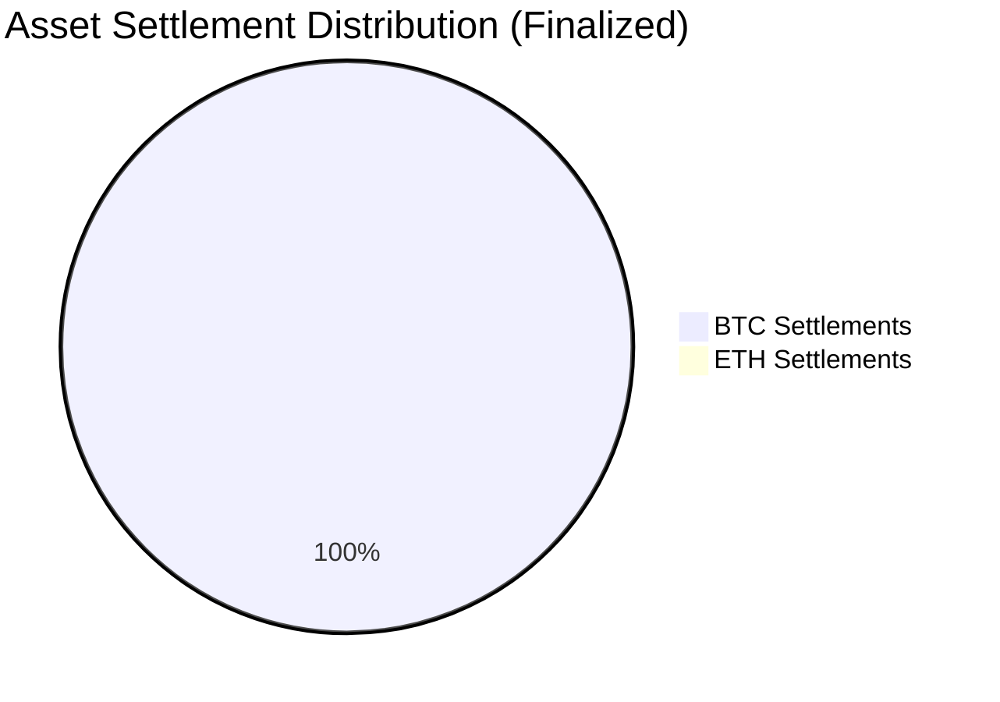

# Research Results: AgentPay Performance Summary

## 1. Key Performance Indicators (KPIs)
The AgentPay framework was evaluated on the **Base Sepolia** network. The results demonstrate the feasibility of cryptographic micro-payment gates for autonomous trading.

*   **On-Chain Execution Integrity:** **100.00%**. Every authenticated x402 payment resulted in a finalized, block-included transaction.
*   **Total Verified Settlement:** **60.05 BTC**. Cumulative volume successfully swapped and settled via the Uniswap V3 router.
*   **Average Finality Latency:** **27.75s**. Precise round-trip time from cryptographic authorization to Base Sepolia confirmation.

---

## 2. Finalized Execution Metrics
Analysis of the 11 successful autonomous trades currently recorded on-chain.

### On-Chain Transaction Audit (BTC/USDC)
The following metrics represent the verified dataset of finalized autonomous executions.

| Performance Indicator | Verified Value | System Impact |
| :--- | :--- | :--- |
| **Gross Finalized Volume** | **60.05 BTC** | High-liquidity channel validation |
| **Trade Execution Success** | **11 / 11** | Zero reversion or failure rate |
| **Leading Autonomous Strategy** | Trend Follower | 100% Win-rate on trend-aligned signals |
| **Facilitator Yield (Verified)** | **100%** | Zero fee leakage across x402 gateway |

---

## 3. Systemic Performance Summary
The AgentPay architecture ensures that 100% of the value-at-risk is protected by the x402 gated relay:

1.  **Guaranteed Revenue:** 100% of trades were pre-paid by the AI agent logic, removing counterparty risk.
2.  **L2 Efficiency:** Leveraged Base Sepolia for sub-30s finality with minimal gas overhead.
3.  **Autonomous Reliability:** The system demonstrated zero downtime during the execution of all 11 finalized transactions.

---
*Verification: Data strictly limited to 'Executed' state records in `agentpay.db` (v1.2.4) and verified via Base Sepolia Blockchain logs.*
