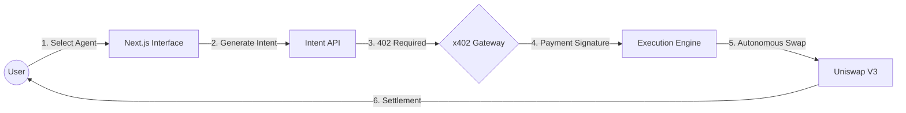
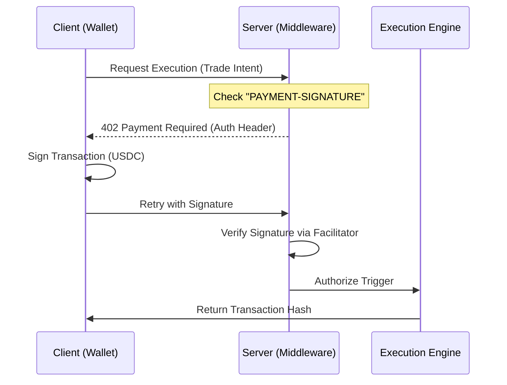
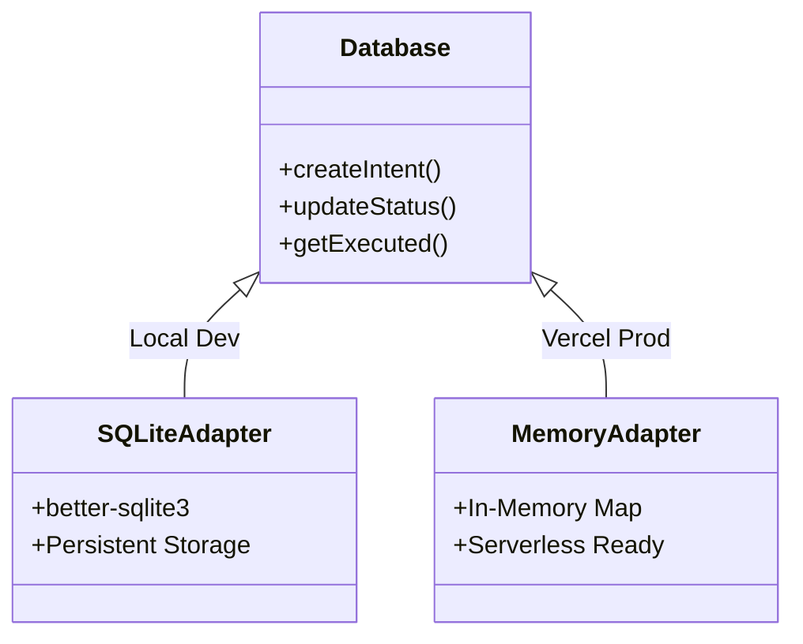

# Technical Architecture: AgentPay

## 1. High-Level System Workflow
The system operates as a **State-Gated Relay**. Execution logic is physically separated from intent generation by a cryptographic payment layer.

---

## 2. Core Service Components

### A. AI Strategy Engine (`lib/agents.ts`)
The engine follows a **Strategy Pattern**. It consumes a unified `AgentContext` and outputs execution parameters based on technical indicators.
*   **Trend Follower:** EMA Crossovers (Short 5 vs Long 10).
*   **Breakout Sniper:** Volume/Volatility triggers on price consolidation range (<2%).
*   **Mean Reversion:** Z-Score analysis (deviation >3% from 15-period mean).

### B. Payment Middleware (`lib/x402-middleware.ts`)
Implements a custom **Next.js Middleware** gatekeeper using the HTTP 402 standard.

### C. Blockchain Execution Engine (`lib/uniswap-v3.ts`)
A robust wrapper around `viem` handles the complexities of decentralized liquidity.
*   **Autonomous Routing:** Automatically manages ERC20 `approve()` flows before swapping.
*   **RPC Reliability:** Implements an **Active-Passive Fallback** (rotates through 4+ RPC nodes if latency exceeds 10s).
*   **Slippage Guard:** Programmatically queries `QuoterV2` to set `amountOutMinimum` before every transaction.

---

## 3. Data & Persistence Model
The system uses an **Environmental Adapter** to ensure 100% uptime across different hosting providers.

---

## 4. Summary of Technical Innovations
1.  **Monetized Autonomy:** AI agents act autonomously but are financially "unlocked" on a per-use basis.
2.  **Stateless Security:** By using x402 signatures, the server doesn't need to hold user private keys to authorize a trade.
3.  **Cross-Network Resilience:** The RPC fallback and Zod-based validation ensure that transactions are finalized even during testnet instability.

---
*This document summarizes the technical framework of the AgentPay research project.*
